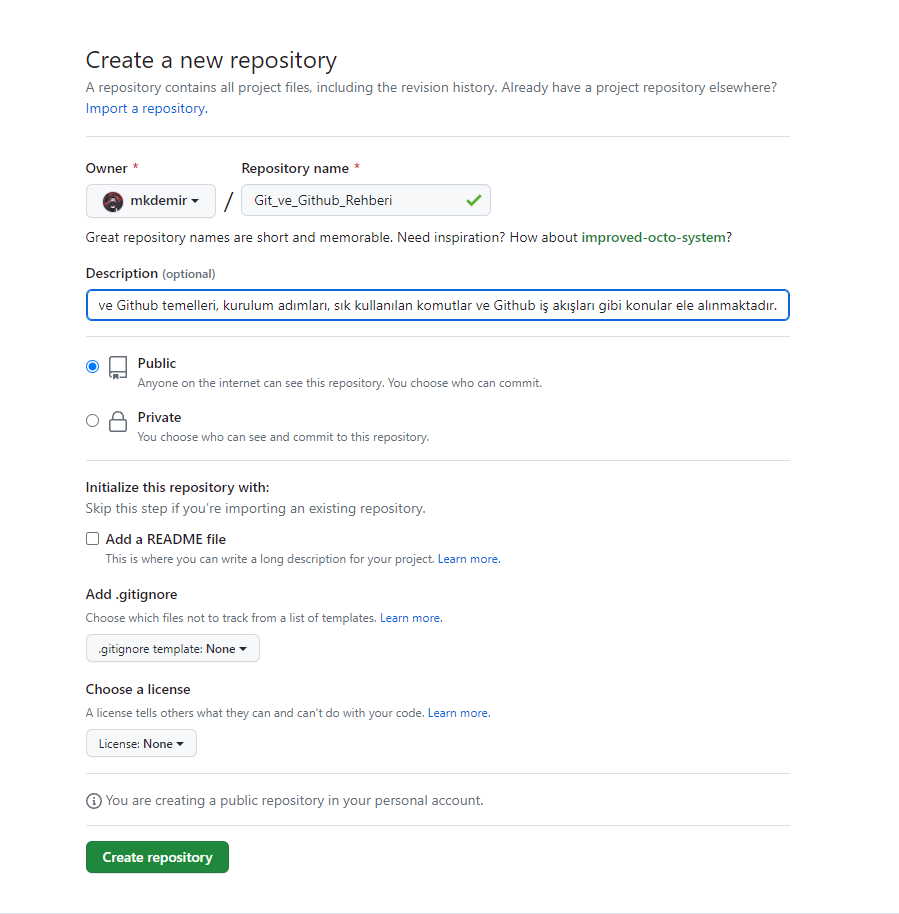
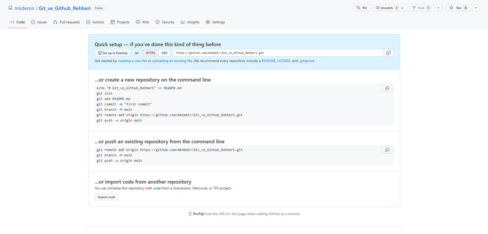

# Git ve Github Rehberi

<p align="center">
   
</p>

## İçindekiler

1. [Giriş](#1giriş)
   - [Git Nedir](#git-nedir)
   - [Popüler VSC Sistemler](#popüler-vsc-versiyon-control-system-sistemleri)
   - [Git'in Kurulumu](#gitin-kurulumu)
   - [Temel Terminal Komutları](#temel-terminal-komutları)
   - [Kullanıcı Adı ve Email Tanımlama](#kullanıcı-adı-ve-email-tanımlama)

2. [Git Temelleri](#2-git-temelleri)
   - [Önemli Git Terimleri](#önemli-git-terimleri)
   - [İlk Commit](#i̇lk-commit)

3. [Git Branch](#3-git-branch)
   - [HEAD Nedir](#head-nedir)
   - [Merge](#merge)
   - [Fast Forward](#fast-forward)
   - [Merge Conflict](#merge-conflict)
   - [Stash](#stash)
   - [Pop](#pop)

4. [Geçmişe Dönme](#4-geçmişe-dönme)
   - [Checkout](#checkout)
   - [Reset ve Revert](#reset-ve-revert)
   - [Git Diff](#git-diff)
   - [Rebase](#rebase)

5. [Github](#5-github)
   - [Github Nedir](#github-nedir)
   - [Git ve Github Arasındaki Farklar](#git-ve-github-arasındaki-farklar)
   - [Github İle Repo](#github-i̇lk-repo)
   - [Git Push](#git-push)
   - [Fetch ve Pull](#fetch-ve-pull)
   - [Clone](#clone)
   - [Fork](#fork)

## 1.Giriş

**Git** ve **Github**, günümüzde yazılım geliştirme alanında en popüler araçlar arasında yer almaktadır. Bu araçlar, kod yönetimi, işbirliği, proje yönetimi ve sürüm kontrolü gibi alanlarda kullanıcılarına birçok avantaj sağlamaktadır. Bu dökümanda, **Git ve Github**'ın ne olduğu, nasıl kullanıldığı ve neden önemli oldukları hakkında temel bilgileri vermeyi amaçlamaktadır.

### **Git Nedir**

**Git**, bir versiyon kontrol sistemi **VCS (Version Control System)** yazılımıdır. Yazılım geliştirme sürecinde kullanılır ve kod değişikliklerinin izlenmesine, takibine, yönetilmesine ve işbirliği yapılmasına olanak tanır.

**Git**, birçok proje için popüler bir **VCS** aracıdır ve özellikle açık kaynaklı (open source) projelerde sıkça kullanılır. **Git**, merkezi bir sunucuya gerek duymadan birçok kişinin aynı kod deposunu paylaşmasına izin verir. Ayrıca, kodun farklı sürümlerini veya dallarını oluşturarak, farklı geliştirme yolları üzerinde çalışmalarını sağlar. Bu, yazılım geliştirme sürecindeki işbirliğini ve verimliliği artırır.

**Git**, **komut satırı arayüzü (Command Line Interface)** veya **grafik arayüzü** ile kullanılabilir.

- Günlük hayatımızda oynadığımız bilgisayar oyunlarındaki **Save Point**'leri git'teki commit'lere benzetebiliriz.
- **Git**, **Linus Torvalds** tarafından geliştirilmiştir.
- **Git**, birçok işletim sistemi üzerinde çalımaktadır.
- Tamamen **açık kaynaklı (open source)** ücretsiz bir şekilde kullanılabiliniyor.
- **Git** artık bir "**Endüstri Standardı**" olarak kullanılmaktadır.

**Github:** Bir portal, **git** repolarımızı yani projelerimizi sakladığımız bir birlerimiz ile paylaşabildiğimiz onun içerisinde interaktif işler yapabildiğimiz bir portal

### **Popüler VSC (Versiyon Control System) Sistemleri**

Birçok versiyon kontrol sistemi vardır. En popüler versiyon kontrol sistemleri şunlardır:

1. **Git:** En popüler ve yaygın olarak kullanılan bir versiyon kontrol sistemidir. Birçok açık kaynaklı projede kullanılır.

2. **SVN (Subversion):** Merkezi bir versiyon kontrol sistemidir. Tek bir merkezi sunucu, tüm değişikliklerin tutulduğu bir merkezi havuz olarak kullanılır.

3. **Mercurial:** Dağıtık bir versiyon kontrol sistemidir. **Git** ile benzer özelliklere sahiptir.

4. **Perforce:** Genellikle büyük ölçekli ticari yazılımlarda kullanılır. Merkezi bir versiyon kontrol sistemidir.

5. **CVS (Concurrent Versions System):** Eski bir merkezi versiyon kontrol sistemidir. Artık pek kullanılmamaktadır.

6. **TFS (Team Foundation Server):** Microsoft tarafından geliştirilmiş bir merkezi versiyon kontrol sistemidir.

7. **Bazaar:** Dağıtık bir versiyon kontrol sistemidir. Özellikle açık kaynaklı projelerde kullanılır.

8. **Darcs:** Dağıtık bir versiyon kontrol sistemidir. Basitliği ve kullanım kolaylığı ile bilinir.

Bu sadece birkaç örnek olup, daha pek çok versiyon kontrol sistemi mevcuttur.

### **Git'in Kurulumu**

**Windows için:**

1. **Git**'i [Git Resmi Sitesi](https://git-scm.com/downloads) adresinden indirin.
2. İndirme işlemi tamamlandıktan sonra **Git Bash** ile kullanabilirsiniz.

**Mac veya Linux için:**

- Mac (Homebrew): `sudo brew install git`
- Debian/Ubuntu: `sudo apt install git`
- Arch Linux: `sudo pacman -S git`
- Centos: `sudo yum install git`

**Git**'i yükledikten sonra, doğru bir şekilde kurulup kurulmadığını test etmek için şu adımları uygulayabilirsiniz:

1. Konsol, kabuk veya uçbirim gibi komut satırı arayüzünü açın.
2. `git --version` komutunu girin.
3. Ekranda **Git**'in yüklü versiyonu ile ilgili bilgileri görmelisiniz.
4. Eğer ekranda versiyon bilgisi göremediyseniz, tekrar kurulum adımlarını kontrol edin.

**Git**'in hangi sürümünü kullanıyor olduğunuzu öğrenmek için `git --version` komutunu kullanabilirsiniz. Bu komut, yüklü olan **Git** sürümünün bilgisini size gösterir. Örneğin, eğer **Git**'in 2.34.1 sürümünü kullanıyorsanız, `git --version` komutunu çalıştırdığınızda ekranda şu şekilde bir çıktı görebilirsiniz:

```bash
➜  ~ git --version
git version 2.34.1
```

Bu bilgi, **Git**'in hangi sürümünü kullandığınızı bilmek için oldukça önemlidir. Farklı **Git** sürümleri farklı özellikler ve davranışlar sunabilir, bu nedenle hangi sürümü kullanıyor olduğunuzu bilmek, kodlama iş akışınızı doğru şekilde planlamanıza ve yönetmenize yardımcı olabilir. Ayrıca, **Git** sürümünüzü kontrol etmek, destek için **Git** topluluğuna başvurmanız gerektiğinde veya **Git** sorunlarını giderirken de oldukça önemlidir.

### **Temel Terminal Komutları**

- `ls (List directory contents)`: Bulunduğun dizindeki tüm içerikleri göster.
- `ls -la (List directory contents and list all)`: Bulunduğun dizideki tüm içerikleri ve gizli içerikleri liste olarka göster.
- `cd (Change Directory)`: Dizin değiştir.
- `pwd: (Print Working Directory)`: Çalıştığın dizini göster.
- `mkdir (Make Directory)`: Dizin oluştur.
- `clear`: Ekranı temizle.
- `touch` : Dosya oluşturma.
- `rm (Remove)` : Silme.
- `rm -rf (Remove recursive force delete directory)`: Belirtilen dizin içindeki dosya ve dizinleri silmesi ve kullanıcıya onay için soru sormadan silinmesi
- `cp (Copy)`: Dosya veya dizinleri kopyalamak için kullanılır.
- `mv (Move)`: Dosya veya dizinleri taşımak veya yeniden adlandırmak için kullanılır.
- `cat (Concatenate)`: Dosyanın içeriğini ekrana yazdırmak için kullanılır.
- `head`: Dosyanın ilk birkaç satırını görüntülemek için kullanılır.
- `tail`: Dosyanın son birkaç satırını görüntülemek için kullanılır.
- `grep`: Belirtilen bir metni içeren satırları bulmak için kullanılır.
- `chmod (Change Mode)`: Dosya veya dizinin izinlerini değiştirmek için kullanılır.
- `sudo (Superuser Do)`: Root kullanıcısı olarak bir komut çalıştırmak için kullanılır.
- `history`: Daha önce kullanılan komutları listeler.

Bu komutlar, bir dosya sistemiyle çalışırken oldukça yararlıdır. Tabii ki, birçok başka terminal komutu da vardır, ancak bunlar en sık kullanılanlarıdır.

### **Kullanıcı Adı ve Email Tanımlama**

Kod geliştirme sürecinde birçok insanla birlikte çalışabiliriz. Bu nedenle, kimin hangi kodu yazdığı ve kimin hangi değişiklikleri yaptığı gibi bilgilerin tutulduğu bir sistem kullanmak oldukça önemlidir. **Git**, bu amaç için ideal bir araçtır. Ancak, diğer insanlarla işbirliği yaparken, hangi kullanıcının hangi değişiklikleri yaptığını bilmek için kendi kullanıcı adımızı ve email adresimizi **Git** sistemimize kaydetmemiz gerekmektedir.

Kullanıcı adınızı ve email adresinizi **Git** sistemine kaydetmek oldukça kolaydır. Terminal veya **Git Bash** gibi bir uygulama üzerinde aşağıdaki komutları çalıştırarak bunu yapabilirsiniz:

Kullanıcı adınızı **Git**'in sistemine kayıt etmek için:

> `git config --global user.name "mkdemir"`
>
> - `config`: Git konfigürasyon ayarlarını değiştirmek için kullanılır.
> - `--global`: Bu komutu kullandığınızda, ayarların her yerde geçerli olacağı anlamına gelir.
> - `user.name`: User adını değiştir.
> - `git config user.name`: Kullanıcı adınızı kontrol etmek için bu komutu kullanabilirsiniz.

Mail adresinizi **Git**'in sistemine kayıt etmek için:

>`git config --global user.email "mkdemir@mkdemir"`
>
> - `user.email`: Git hesabınızda gösterilecek email adresinizi değiştirir.
> - `git config user.email`: Email adresinizi kontrol etmek için bu komutu kullanabilirsiniz

Yukarıdaki adımları takip ederek kendi kullanıcı adınızı ve email adresinizi **Git** sistemine kaydedebilirsiniz.

**Not:** Git Varsayılan Düzenleyicisini Değiştirme

- **Git**'in varsayılan metin düzenleyicisi, genellikle **Nano** veya **Vim** gibi bir **konsol** editörüdür. Ancak, birçok kullanıcı için bu editörler kullanımı zor veya rahatsız edici olabilir. Neyse ki, **Git**'in default editör ayarlarını değiştirmek oldukça kolaydır.

- Aşağıdaki örneklerde, **Git** varsayılan editörünü değiştirmek için kullanabileceğiniz bazı komutlar verilmiştir:

> - **Vim:** `git config --global core.editor "vim --nofork"`
> - **Emacs:** `git config --global core.editor emacs`
> - **Gedit (Linux):** `git config --global core.editor "gedit --wait --new-window"`

Yukarıdaki komutları kullanarak, Git'in default editör ayarlarını değiştirerek kendi tercih ettiğiniz metin düzenleyicisini kullanabilirsiniz.

**Not:** Ön tanımlı olarak ana branch ismi `master` olarak kullanılmaktadır. Eğer bu ana branch ismini değiştirmek isterseniz.

`git config --global init.defaultBranch <name>`

İle değiştirebilirsiniz.

## 2. Git Temelleri

### **Önemli Git Terimleri**

- **Commit:** Git ile yapılan değişikliklerin kaydedildiği bir işlemdir. Bu işlem sayesinde herhangi bir zamanda geriye dönülerek değişiklikler eski haline getirilebilir.

- **Branch:** Projelerin farklı dallara ayrılarak geliştirilebilmesini sağlayan bir özelliktir. Bu sayede projenin farklı özellikleri ayrı ayrı geliştirilebilir ve sonrasında birleştirebiliriz.

- **Repository:** Git'in başlatıldığı klasördür. Bu klasördeki dosyalar ve değişiklikler Git ile kontrol altına alınır.

- **Working Directory (Çalışma Dizini):** Bu, projenin bulunduğu klasördür ve tüm dosyalar burada saklanır. Bu dizindeki dosyaları değiştirir veya yeni dosyalar eklersiniz.

- **Index - Staging Area:** Bu alana bazen *"sahne"* denir. Bu alanda değişiklik yaptığınız dosyalar bulunur, ancak henüz projenin bir parçası değillerdir. Bu, değişiklikleri daha sonra kaydetmek üzere hazırlamak için kullanılan bir ara bölgedir. Yani, dosyalarda yaptığınız değişiklikleri, Git'e kaydetmek istediğinizde buraya eklersiniz.

- **Local Repository:** Bu, Git'in projenin tüm geçmiş sürümlerini ve değişikliklerini sakladığı yere denir. Yani, burası dosyalardaki değişiklikleri kaydettiğiniz yerdir. Local Repository, proje dizininde .git adı verilen bir klasör içinde saklanır. Bu klasör, projenin tam tarihçesini ve Git'in projeyle ilgili diğer verilerini içerir.

- **Upstream Rrepository:** Bir projenin orijinal kaynak kod deposudur. Bu genellikle bir açık kaynak yazılım projesi için bir GitHub deposu veya benzeri bir git barındırma servisi olabilir. Fork işlemi yapıldığında, kullanıcının hesabında bir kopya oluşturulur ve bu kopya, orijinal proje ile senkronize edilebilir. Senkronize edildiğinde, kullanıcının kopyası, değişikliklerin yapılmasına, commit edilmesine ve bir pull request gönderilmesine izin verir. Upstream repository, orijinal proje ile senkronize edildiğinde, bu değişikliklerin orijinal projeye dahil edilmesini sağlar. Bu nedenle upstream repository, bir projenin yönetimi ve katkıda bulunulması için önemlidir.

**Yazılanları Görselleştirirsek:**

**Working Directory** -> `git add` -> **Index - Staging Area** -> `git commit` -> **Local Repository** -> `git push` **Upstream Repository**

`git status`: Git'in güncel durumunu gösterir. Bu komut ile hangi branch'te olduğumuz veya hangi dosyaların staging alanında olduğu gibi bilgiler verir.

> `fatal: not a git repository (or any of the parent directories): .git`: Hatası, mevcut klasörün Git deposu olarak başlatılmadığını veya başka bir sebepten dolayı Git ile bağlantının kesildiğini gösterir. Bu hatanın nedeni genellikle git init komutunun yapılmamış olması ya da .git klasörünün silinmiş olmasıdır.

```bash
➜  Think git:(master) git status
On branch master # Master branch'indeyiz.

No commits yet # Şimdiye kadar hiç commit yapılmadığını söylüyor.

nothing to commit (create/copy files and use "git add" to track) # Commit edilecek bir şey yok diyor.
```

`git init`: Bir klasöre Git deposu eklemek için kullanılan bir komuttur. Bu komut, mevcut bir klasörü veya boş bir klasörü bir **Git** deposuna dönüştürür.

- Bu komutu kullanarak bir klasöre **Git** deposu ekledikten sonra, dosyaları **stagelamak (stage)**, **commit (commit)** etmek ve diğer **Git** komutlarını kullanarak değişiklikleri kontrol etmeye başlayabilirsiniz.

- master or main branch Git'in bir projeye başlatılması için kullanılır. Bu komut ile projenin bulunduğu klasöre .git adında bir klasör oluşturulur ve Git projeye başlatılmış olur.

### **İlk Commit**

Genel terimleri gördüğümüze göre küçük bir örnek yaparak başlayalım.

- Bir dizin oluşturuyoruz ve içerisine girip `git init` komutunu çalıştırıyoruz. Bu dizin içine `think.txt` adlı bir dosya oluşturduktan sonra `git status` ile kontrol ediyoruz.

```bash
➜  Think git:(master) ✗ git status
On branch master

No commits yet

Untracked files:
  (use "git add <file>..." to include in what will be committed)
        think.txt

nothing added to commit but untracked files present (use "git add" to track)
```

- Burada dosyayı oluşturduğunu ve **Untracked** yani takip edilmediğini söylüyor.

- `git add think.txt` diyerek dosyanın takip edilmesini sağladık.

- `git commit -m "First Commit"` diyerek dosyayı commit'lemiş olduk.

```bash
➜  Think git:(master) ✗ git commit -m "First Commit"
[master (root-commit) 6130636] First Commit
 1 file changed, 0 insertions(+), 0 deletions(-)
 create mode 100644 think.txt
```

**Not:** `git commit --amend -m "New commit message."`: Commit mesajını yanlış yazdım geri dönmek için

- İlk commitimizi başarılı bir şekilde attık.

- `git log`: Git versiyon kontrol sisteminde yapılan commitleri ve bu commitlerin detaylarını gösteren bir komuttur. Bu komut çalıştırıldığında, tarih sırasına göre tüm commitlerin listesi görüntülenir. Her bir commit, benzersiz bir kimlik numarası (hash) ile tanımlanır ve hangi branch veya tag'de olduğu, kimin yaptığı, ne zaman yapıldığı, ne kadar değişiklik yapıldığı gibi detaylar da görüntülenebilir.

  - `(HEAD -> master)` güncel içerisinde bulunduğumuz branch'i referans alır genelde, genelde de en son commiti söyler bize

- `.gitignore`: Git'in belirtilen dosyaları görmezden gelmesine izin veren bir dosyadır. Bu dosya, Git projesindeki belirli dosyaların veya dosya türlerinin depolanmaması veya takip edilmemesi gerektiği durumlarda kullanılır. Gitignore dosyası, proje kök dizinine yerleştirilir ve adı .gitignore olarak kaydedilir. Bu dosyaya eklenen öğeler, Git'in bunları takip etmesini veya depolamasını engeller. Örneğin, .gitignore dosyasına "node_modules" yazarak, Git'in bu klasörü takip etmesi engellenir ve böylece projenin boyutu azaltılır ve depolama alanı tasarrufu sağlanır. Gitignore dosyaları, farklı diller ve projeler için önceden hazırlanmış şablonlar (template) içeren Gitignore.io gibi kaynaklardan da indirilebilir.

## 3. Git Branch

Branch, Git'te ana projeden ayrılan farklı bir projenin kopyasıdır. Bu, bir projenin farklı sürümlerinin yönetilmesini sağlar. Ana projeden yeni bir dal alarak, o dalda yapılan değişiklikler ana projeyi etkilemez. Böylece birden fazla kişi aynı proje üzerinde çalışırken, farklı dalarda çalışarak kodları yönetebilirler. Ayrıca, farklı özelliklerin geliştirilmesi, hata düzeltmeleri gibi farklı görevleri üstlenebilirler. Branch'ler, daha sonra birleştirilebilir veya silinebilir.

Master branch, ana branch'dir. Ana branch'de gördüğümüz proje yayına alırız.

### **HEAD Nedir**

HEAD, Git'in içinde bulunduğumuz konumu belirten bir referanstır. Genellikle en son commit'i işaret eder. Bu, nerede olduğumuzu ve hangi commit üzerinde çalıştığımızı belirlememizi sağlar.

### **Merge**

Git'te merge, farklı branch'lerin birleştirilmesini sağlayan bir işlem olarak tanımlanır.

- `git branch`: Komutu ile mevcut branch'leri görüntüleyebilirsiniz.
- `git branch <name>`: Yeni bir branch oluşturmak **`<name>`** kısmına açmak istediğimiz branch adını yazıyoruz. Örnek feat (feature) adlı bir branch açtık.
- `git switch <branch name>`: Brach'ler arasında geçiş yapmak için kullanıyoruz.
- `git merge feat`: Komutu ile feat branch'ini master branch'ine birleştirebilirsiniz. Bu işlem sırasında, hangi branch'in içeriğini alacağınızı belirlemek için "theirs" veya "ours" gibi parametreler de kullanabilirsiniz. (Hangisini içeriğe alacaksak onu yazmamız gerekiyor).

Ayrıca, merge işlemi sırasında çakışmaların oluşması durumunda, Git otomatik olarak bir "merge conflict" oluşturur ve kullanıcının bu çakışmaları çözmesini bekler. Bu çakışmaların nasıl çözüleceği, birleştirme işlemi esnasında belirlenir.

Bu şekilde, Git'in merge işlemi ile farklı branch'lerin içeriklerini birleştirerek projenizi geliştirebilirsiniz.

### **Fast Forward**

Fast forwarding, birleştirme işlemi sırasında, kaynak branch'in (genellikle feature branch) değişikliklerinin, hedef branch'e (genellikle master branch) direk olarak uygulanmasıdır. Bu işlem sırasında, herhangi bir çakışma olmadığı ve her iki branch'in de aynı değişiklikleri içerdiği varsayılır.

Örnek olarak, `feat` branch'inde bir dosyanın satırını değiştirdik ve daha sonra `master` branch'ine geri döndük ve `feat` branch'ini `master` ile birleştirmek istedik. Eğer `feat` branch'inin ve `master` branch'inin hiçbir farkı yoksa (yani `master` branch'inin son commit'i, `feat` branch'indeki son commit'e göre önce oluştuysa), bu durumda bir fast forward merge gerçekleşir. Bu durumda, Git, `master` branch'ine, `feat` branch'inin commit'ini ekleyerek günceller.

Örnek bir senaryo:

1. git branch feat: feat branch'ini oluşturduk ve bu branch'e geçtik.
2. echo "New line" >> file.txt: file.txt dosyasına bir satır ekledik ve commit ettik.
3. git switch master: master branch'ine geçtik.
4. git merge feat: feat branch'ini master ile birleştirmek istedik ve bir fast forward merge gerçekleşti. Bu nedenle, file.txt dosyasına eklediğimiz yeni satır, master branch'ine eklendi.

Bu şekilde, fast forward merge, herhangi bir çakışma olmadan farklı branch'leri birleştirmek için kullanılabilir.

### **Merge Conflict**

Merge Conflict, Git branch'leri arasındaki değişikliklerin birleştirilmesi sırasında ortaya çıkan çakışmaları ifade eder. Bir Merge Conflict, aynı dosyanın aynı satırlarında farklı değişikliklerin yapıldığı durumlarda oluşur.

Örneğin, bir ekip aynı dosyanın aynı satırlarını farklı branch'lerde değiştirirse, bu durumda bir Merge Conflict oluşabilir. Merge işlemi sırasında Git, hangi değişiklikleri birleştireceği konusunda kararsız kalabilir.

Bu durumda, Git çakışan dosyaları işaretleyerek, kullanıcının bu dosyalarda çakışan değişiklikleri elle birleştirmesine olanak sağlar. Kullanıcılar, conflict'in olduğu dosyalarda çakışan değişiklikleri elle birleştirerek veya belirli bir sürümü kabul ederek (theirs veya ours seçeneklerini kullanarak) conflict'i çözebilirler.

Örneğin, aşağıdaki örnek merge işlemi sırasında bir Merge Conflict oluştu:

```bash
➜  Think git:(master) ✗ git merge feature
Auto-merging myfile.txt
CONFLICT (content): Merge conflict in myfile.txt
Automatic merge failed; fix conflicts and then commit the result.
```

Bu durumda, kullanıcının conflict'i çözmesi gerekecektir. Git, conflict'in olduğu dosyaları işaretleyerek kullanıcıya hangi satırlarda çakışma olduğunu gösterir. Kullanıcı, bu satırları elle düzenleyerek veya belirli bir sürümü seçerek conflict'i çözebilir.

```bash
➜  Think git:(master) ✗ git status
On branch master
You have unmerged paths.
  (fix conflicts and run "git commit")

Changes to be committed:

        modified:   file.txt

Unmerged paths:
  (use "git add <file>..." to mark resolution)

        both modified:      file.txt

```

Bu durumda, kullanıcının conflict'i çözmek için öncelikle git status komutu ile hangi dosyaların conflict içerdiğini görmesi gerekmektedir. Daha sonra, conflict içeren dosyaları elle düzenleyerek veya git add komutu ile belirli bir sürümü seçerek conflict'i çözebilir.

### **Stash**

Stash: Saklamak veya depolamak anlamlarını taşır.

Git stash, Git versiyon kontrol sistemi kullanılarak yapılan değişiklikleri geçici olarak kaydetmenizi sağlayan bir özelliktir. Bu, henüz tamamlanmayan bir iş üzerinde çalışırken veya bir dal üzerinde çalışırken aniden başka bir acil işle ilgilenmeniz gerektiğinde özellikle kullanışlıdır.

Ayrıca, git stash komutunu kullanırken, mevcut değişikliklerinizin yanı sıra indekslenmemiş dosyalarınız da kaydedilir. İndekslenmemiş dosyalar, dosyaların sadece bir kısmının değiştirilmesi durumunda ortaya çıkar ve git add komutu ile stagelenmemiş dosyalar olarak tanımlanırlar.

`git stash` komutu, birçok farklı parametrelerle kullanılabilir. Örneğin:

- `git stash list`: Kaydedilen tüm stash'leri listeler.
- `stash@{0}`: git stash listesi içerisindeki ilk yani en son eklenen geçici değişiklikler listesindeki kaydedilmiş çalışma dizininin (working directory) saklandığı referans adıdır.
- `git stash apply`: En son kaydedilen stash'i geri yükler.
- `git stash apply stash@{n}`: Belirtilen numaralı stash'i geri yükler.
- `git stash drop`: En son kaydedilen stash'i siler.
- `git stash drop stash@{n}`: Belirtilen numaralı stash'i siler.

Örnek kullanımı aşağıdaki gibi olabilir:

```bash
->  git stash
->  git checkout master
Switched to branch 'master'
->  # master branch'te başka bir iş yapılır
->  git stash list
stash@{0}: WIP on feat: 1234abcd Some unfinished work
->  git stash apply
->  # çalışılan dalın üzerindeki işe geri dönülür
```

Ekstra olarak restore komutunu'da kullabilirsiniz.

- `git restore ilkbolum.txt`: En son commit'te ne durumda isen ben ona döndürür.

### **Pop**

 Git stash pop, geçici olarak saklanan değişiklikleri geri yüklerken, Github ile ilgili bir işlem yapmaz.

- `git stash pop`: komutu, en son kaydedilen stash girdisini alır ve bu değişiklikleri uygular (apply) ve stash havuzundan (stash pool) kaldırır. Yani, pop işlemi stash havuzundan en son eklenen stash girdisini çıkarır ve çalışma dizinindeki değişiklikleri bu girdiye göre günceller. Yani zuladan dışarı atma
- `git stash list`: Güncel zuladıklarımı verir.
- `git stash apply stash@{0}`: Komutu, stash havuzundan belirli bir stash girdisini uygulamak (apply) için kullanılır. Burada {0} indeks numarası, stash havuzundaki girdinin sırasını belirtir. Örneğin, stash@{0} en son eklenen stash girdisini ifade eder.
- `git stash clear`: Komutu ise stash havuzundaki tüm stash girdilerini siler. Bu komutu kullanmadan önce dikkatli olunması gerekir, çünkü stash havuzundaki tüm değişiklikler kalıcı olarak kaybolur.

## 4. Geçmişe Dönme

### **Checkout**

Checkout, belirtilen bir commit'e veya dalın bir önceki commit'ine geri dönmemizi sağlar. Bu işlem sonrasında HEAD işaretçisi, doğrudan commit veya dalı gösterir. Ancak, git checkout komutu ile commit'e geri döndüğümüzde Detached HEAD durumuna düşeriz. Bu durumda, HEAD işaretçisi doğrudan bir commit'i işaret eder ve mevcut konum geçici bir durumdur. Bu nedenle, bir işlem yapmadan önce mutlaka aktif bir dalda çalıştığımızdan emin olmalıyız.

Reattaching HEAD, detached HEAD durumundan kurtulup tekrar bir dal üzerinde çalışmaya devam etmek için kullanılan bir terimdir. Detached HEAD durumunda, HEAD işaretçisi doğrudan bir commit'i gösterir ve herhangi bir dal ile ilişkisi yoktur. Bu durumda, yapacağınız değişiklikler doğrudan commit'e yapılacaktır ve bunları başka bir dalda birleştiremezsiniz.

Reattaching HEAD, yapmış olduğunuz değişiklikleri bir dalda birleştirebilmek için HEAD işaretçisini tekrar bir dala yönlendirmeyi ifade eder. Bu işlemi yapmak için, öncelikle hangi dalda çalışmak istediğinizi belirlemelisiniz. Daha sonra, git checkout komutu kullanarak HEAD işaretçisini o dala yönlendirebilirsiniz.

Örneğin, detached HEAD durumundayken master dalına geri dönmek için şu komutu kullanabilirsiniz:

`git checkout master`

Bu komut, HEAD işaretçisini master dalına yönlendirir ve tekrar master dalında çalışmaya başlamanızı sağlar.

### **Reset ve Revert**

Reset ve Revert, git'te geçmişe dönmek için kullanılan iki farklı yöntemdir.

- `git reset`: Belirtilen bir commit'e geri dönmeyi sağlar ve bu işlem esnasında commit'ler silinebilir veya korunabilir.
  - 1. Seçenek: Commit'leri sil değişiklikler kalsın
  - 2. Seçenek: `git reset --hard  <commit id>` belirtilen commit'e kadar olan tüm commit'leri silersiniz ve geri dönüşü olmayan bir şekilde geçmişe dönersiniz. Bu nedenle, bu komutu kullanırken dikkatli olmak önemlidir.

- `git revert <commit>`: Bu komutu kullandığınızda, belirli bir commit'i geri alırsınız ve bu işlem sonucunda yeni bir commit oluşur. Bu sayede, Git geçmişi değiştirilmez, ancak istenmeyen değişiklikler geri alınmış olur. git revert işlemi sonrasında yapılan commit, geri alınan commit'in tam tersi işlevi görür. Loglar tutuluyor. History bozmadık.

Özetle, git reset komutu geçmişteki değişiklikleri silmenizi sağlar, ancak geri dönüşü olmayan bir şekilde. git revert komutu ise geçmişteki değişiklikleri geri alır ancak Git geçmişi bozulmaz ve yeni bir commit oluşur.

### **Git Diff**

Git versiyon kontrol sistemi ile çalışırken, değişiklikleri görüntülemek için kullanılan bir komuttur. Bu komut, dosya veya dizinler arasındaki farkları gösterir ve değişikliklerin tam olarak neler olduğunu ayrıntılı olarak açıklar.

`git diff` komutunu kullanarak, mevcut çalışma kopyası ve son commit arasındaki farkları görebilirsiniz. Bu, yeni eklenen veya silinen dosyaları, değiştirilen satırları ve dosyaların farklı sürümlerindeki değişiklikleri gösterir.

Ayrıca, `git diff` komutu, farklı branch'ler arasındaki farkları, değiştirilmiş veya silinmiş dosyaları, değiştirilmiş satırları ve farklı sürümlerdeki dosyaları göstermek için kullanılabilir. Bu, birden fazla kişiyle çalışırken, değişiklikleri birbirleriyle karşılaştırma nızı ve senkronize etmenizi sağlar.

- `git diff`

- `git diff HEAD`: Değiştirilmiş veya eklenen dosyaları son commit ile karşılaştırır. "HEAD" son commit'i ifade eder. Bu komutu kullanarak, son commit'ten önceki tüm değişiklikleri görebilirsiniz.

- `git diff <commit1> <commit2>` : Commitler arasındaki farkı görmek için.

- `git diff <branch> <branch2>`: Branchler arasındaki farkı göster.

- `git diff --cached` komutu da kullanılabilir. Bu, "staged" (commit öncesi hazırlanan) değişiklikleri gösterir. Yani, henüz commit etmeden önce, "git add" komutu ile hazırlanmış değişiklikleri gösterir.

Ayrıca, git diff --color-words komutu kullanılarak, değişen kelime veya karakterlerin renkli olarak gösterilmesi sağlanabilir. Bu, değişiklikleri daha ayrıntılı ve kolay anlaşılır hale getirir.

**Not:** Eğer aradaki boşluk sıkıntı çıkarırsa .. koyabilirsiniz.

### **Rebase**

**Rebase:** Bazı değiştirme

Git'te "rebase" komutu, bir dalı diğerine eklemek için kullanılır ve birleştirme işlemi yaparken diğer dalın değişiklikleri geçerli dala uygulanır. Bu, daha temiz bir Git geçmişi sağlar ve uzun süreli projelerde sıkça kullanılır. Örnek kullanım: git rebase branch-name.

- `git switch feat`

- `git rebase master` : Ama feat'in içerisinde çalıştırıyoruz.

**Not:** Burada tarihi baştan yazıyoruz.

## 5. GitHub

### **GitHub Nedir**

**Git Nedir:** Sürüm kontrolü sistemi olarak bilinir. Sürüm kontrolü, bir projenin değişikliklerinin kaydedilmesi, takip edilmesi ve yönetilmesi için kullanılan bir teknolojidir. Git, birçok kişinin aynı projede çalışması durumunda kullanışlıdır.

**GitHub Nedir:** Bu versiyon kontrol sistemi ile birlikte kullandığımız projeleri depolayabileceğimiz bir portal

### **Git ve GitHub Arasındaki Farklar**

Git, sadece bir sürüm kontrolü sistemidir ve yerel bir bilgisayarda çalışırken GitHub, Git üzerine inşa edilmiş bir bulut barındırma hizmetidir.

Git, bir projenin sürüm kontrolünü yönetirken, GitHub, projenin paylaşımı, işbirliği, sorun takibi ve kod incelemesi gibi ek özellikler sunar.

**Star:** GitHub'daki bir projeyi beğenmek ve ileride kolayca erişmek istediğinizi belirtmek için kullanılan bir özelliktir.

**Explore:** İlgi alanlarınıza göre önerilen projeleri ve popüler projeleri gösteren bir özelliktir.

### **Github İlk Repo**

Github'a ilk repo oluşturmak için öncelikle bir Github hesabınızın olması gerekiyor. Eğer henüz bir hesabınız yoksa, Github adresinden hesap oluşturabilirsiniz.

İlk repo oluşturmak için aşağıdaki adımları takip edebilirsiniz:

1. Github hesabınıza giriş yapın.

2. Sağ üst köşedeki '+' butonuna tıklayarak "New repository" seçeneğini seçin.

3. Repository adını ve açıklamasını girin. Repository adınızın benzersiz olması gerektiğini unutmayın.

4. Public veya Private olarak repo ayarlarını belirleyin. Public seçeneği herkese açık olurken, Private seçeneği sadece sizin veya ekibinizin erişebileceği şekilde oluşturulur.

5. README dosyası oluşturma seçeneğini seçin. Bu seçenek, repo sayfanızda görüntülenen açıklama sayfasıdır.

6. Lisans seçeneğini belirleyin. Eğer projeniz açık kaynak ise bir lisans seçmeniz gerekmektedir.

7. "Create repository" butonuna tıklayın ve ilk repo'nuzu oluşturun.

Artık ilk repo'nuzu oluşturduğunuza göre, projenizi bilgisayarınızdan Github'a yüklemeye başlayabilirsiniz. Bunun için öncelikle bilgisayarınıza git yüklemeniz ve projenizi local olarak oluşturmanız gerekiyor.

<p align="center">
   
</p>

Repo ile oluşturulduğunda "Quick Setup" ekranı çıkacak.

<p align="center">
   
</p>

Bize `.git` ile biten bir URL oluşturdum diyor. Sonunda `.git` olması bizim repomuza referans verdiği anlamına gelir.

Yeni bir repository oluşturmak için aşağıdaki adımları takip edebilirsiniz:

```bash
…or create a new repository on the command line

# Yeni bir repository oluşturma
echo "# Git_ve_Github_Rehberi" >> README.md # README.md dosyası oluşturulur ve içine başlık yazılır
git init # git repository oluşturulur
git add README.md # README.md dosyası staged area'ya eklenir
git commit -m "first commit" # staged area'daki değişiklikler commit edilir
git branch -M main # default branch ismi main olarak değiştirilir
git remote add origin https://github.com/mkdemir/Git_ve_Github_Rehberi.git # remote repository belirlenir
git push -u origin main # origin'e commitler gönderilir

git push -u origin main
```

Eğer hali hazırda olan bir projeniz varsa onu Github pushlamak isterseniz aşağıdaki adımları takip edebilirsiniz.

```bash
…or push an existing repository from the command line

git remote add origin https://github.com/mkdemir/Git_ve_Github_Rehberi.git # Bunu sadece bir defa kullanacağız.
git branch -M main
git push -u origin main
```

- `remote`, uzaktaki repository için kullandığımız bir terim.

- Bide `origin` kavramı çıkyor anlamı başlangıcı demek bu bir isim bir komut değildir. Yani `origin` dediğimde `https://github.com/mkdemir/Git_ve_Github_Rehberi.git` bu url temsil etmektedir.

- `git push` ile de içerisindeki bulunduğunuz `commit`'leri `origin` ile temsil edilen yere gönderiyor.

- `git push -u origin main`: Origin'e yolla diyor. Her zaman URL girmemizin önüne geçmektedir.

Yada başka bir repository'den kodları çağrabilirsin.

```bash
...or push an existing repository from the command line

git remote add origin https://github.com/mkdemir/Git_ve_Github_Rehberi.git 
git branch -M main
git push -u origin main
```

### **Git Push**

`git push -u origin main`: **-u (upstream)** ifadesi, varsayılan yukarı akış depoya **(origin)** ve ana dal **(main)** için bir yer işaretçisi belirler. Bu işaretçi sayesinde, bir sonraki git push komutunu çağırdığınızda, Git, origin main argümanlarını tekrarlamak yerine bu yer işaretçisini kullanarak push işlemi yapar.

Bu sayede, git push komutunu çağırdığınızda, Git otomatik olarak belirlenen yer işaretçisine göre işlem yapar.

### **Pull Request**

Pull request (PR), bir yazılım projesinde değişiklik yapmak isteyen bir kullanıcının, projenin sahibi ya da ekibinin dikkatini çekmek ve değişikliklerinin ana kod tabanına (master dalı gibi) birleştirilmesini talep etmek için yaptığı bir istektir.

Bir kullanıcı, projenin bir kopyasını (fork) oluşturarak değişikliklerini yapar ve bu değişiklikleri commit ederek kendi fork dalında saklar. Daha sonra, bu değişiklikleri orijinal projenin sahibine göstermek için bir pull request açar. Pull request, değişikliklerin açıkça açıklandığı bir iletişim kutusu görevi görür ve projenin sahibi ya da ekibi tarafından incelenir.

Eğer değişiklikler onaylanırsa, projenin sahibi ya da ekibi, pull request'i kabul ederek değişiklikleri ana kod tabanına (master dalı gibi) birleştirir. Bu sayede, projeye katkıda bulunan herkesin değişiklikleri, ana kod tabanına dahil edilerek projenin geliştirilmesine katkı sağlar.

Pull requestler, açık kaynak projelerinde çok yaygın olarak kullanılır ve topluluk tabanlı projelerin geliştirilmesinde önemli bir rol oynar.

Örneğin, açık kaynak bir proje olan "MyAwesomeProject" üzerinde çalışıyorsunuz ve bir hata fark ettiniz. Bu hatayı düzeltmek istiyorsunuz ve değişikliğinizi proje sahibine göstermek için bir pull request açacaksınız.

İşlem adımları şu şekilde olabilir:

1. Projenin GitHub sayfasına gidin ve projeyi fork edin (kendi hesabınıza bir kopya oluşturun).
2. Kendi fork dalınızı (branch) oluşturun ve hata düzeltmesini yapın.
3. Değişikliklerinizi commit edin ve GitHub hesabınıza yükleyin.
4. GitHub sayfasından, pull request (PR) düğmesine tıklayın ve değişikliklerinizi açıklayan bir açıklama yazın.
5. PR'nizi projenin sahibine gönderin.
6. Projenin sahibi veya ekibi, PR'nizi inceleyecek ve hata düzeltmesinin kabul edilip edilmeyeceğine karar verecek.
7. Eğer değişiklikler kabul edilirse, projenin sahibi veya ekibi değişiklikleri ana kod tabanına (master dalı gibi) birleştirir ve sizin değişiklikleriniz de projede yer almış olur.

Bu şekilde, pull request işlemi sayesinde, herhangi bir projeye katkıda bulunabilirsiniz ve bu projelerin geliştirilmesine katkıda bulunabilirsiniz.

Not: Upstream branch'leri görmek için `git branch -r` komutunu kullanabilirsiniz.

### **Fetch ve Pull**

Fetch ve Pull, Git'te uzak bir deposundan (remote repository) yeni değişiklikleri alma işlemleridir.

Fetch işlemi, uzak depodaki yeni değişiklikleri lokal depoya indirir ancak lokaldeki çalışma dizinine (working directory) birleştirmez. Bu işlem, uzak depodaki değişikliklerin var olup olmadığını kontrol etmek için kullanılabilir.

Örneğin, başka bir kullanıcının değişiklikleri varsa ve siz bu değişiklikleri görmek istiyorsanız, git fetch komutunu kullanarak bu değişiklikleri indirebilirsiniz. Bu, değişiklikleri lokalde kontrol etmek için iyi bir yol olabilir.

- `git fetch`: Değişiklikleri al lokale getir.

Pull işlemi ise, uzak depodaki yeni değişiklikleri hem indirir hem de lokaldeki değişikliklerle birleştirir. Bu işlem, uzak depodaki değişiklikleri lokaldeki çalışma dizinine (working directory) eklemek istediğinizde kullanılır.

Örneğin, bir proje üzerinde çalışıyorsanız ve projenin uzak deposunda yeni bir değişiklik olduğunu öğrendiyseniz, git pull komutunu kullanarak bu değişiklikleri indirerek lokaldeki çalışma dizininize ekleyebilirsiniz. Bu şekilde, uzak ve lokaldeki değişiklikler birleştirilir ve projenin en güncel haline sahip olursunuz.

- `git pull` = `git fetch` + `git merge`
- `git pull origin main`: Uzak depodaki (remote repository) "origin" adlı depodan "main" adlı dalın (branch) değişikliklerini indirerek lokal depoya (local repository) birleştirir. Yani, bu komut, uzak depodaki en güncel "main" dalındaki değişiklikleri indirir ve lokaldeki "main" dalıyla birleştirir.

Kısacası, Fetch işlemi sadece uzak depodaki değişiklikleri indirirken, Pull işlemi hem indirme hem de birleştirme işlemlerini gerçekleştirir.

### **Clone**

`git clone` komutu, bir uzak depodaki (remote repository) tamamını veya belirli bir dalını (branch) kopyalamak için kullanılır. Yani, mevcut bir projenin tamamını veya bir bölümünü kopyalamak ve yerel makinede (local machine) bir kopya oluşturmak için kullanılır.

Bu komut, uzak depodaki tüm dosyaları, tarihçeyi ve yapılandırmayı kopyalar ve lokalde yeni bir Git deposu oluşturur. Bu, projeye katılmak isteyen birisinin projeyi baştan oluşturmak yerine, mevcut bir kopyayı indirerek projede hızlıca yer almasına olanak sağlar.

Örneğin, bir GitHub deposuna (repository) sahipseniz, bu komutu kullanarak yerel makinenizde bir kopya oluşturabilirsiniz:

`git clone https://github.com/kullaniciAdi/projeAdi.git`

Bu komut, uzak depodaki "projeAdi" adlı depoyu indirir ve yerel makinede "projeAdi" adlı bir dizin oluşturur. Artık, lokaldeki kopyayı değiştirebilir, yeni dosyalar ekleyebilir, yeni dal (branch) oluşturabilir ve değişiklikleri uzak depoya (remote repository) gönderebilirsiniz.

### **Fork**

Fork, bir GitHub deposunu (repository) kopyalamanın bir yoludur. Bu işlem, bir projeye katkıda bulunmak veya kendi projenizi başlatmak için kullanışlıdır. Fork işlemi, projenin tamamını veya belirli bir dalını (branch) kopyalar ve bu kopya, kullanıcının GitHub hesabına kaydedilir.

Fork işlemi sayesinde, bir depoya katkıda bulunmak isteyen kullanıcılar, projeyi kendi GitHub hesaplarına kopyalayabilirler. Bu kopya üzerinde değişiklikler yapabilir, yeni özellikler ekleyebilir, hataları düzeltebilir veya depoyu tamamen farklı bir yöne yönlendirebilirler. Kullanıcılar, kendi hesaplarındaki kopyaları üzerinde çalıştıkları değişiklikleri ve geliştirmeleri, orijinal projenin sahibine yönlendirmek için Pull Request işlemi kullanabilirler.

Fork işlemi, bir projeye katkıda bulunmak isteyenlerin, projenin sahibinden izin almalarına gerek kalmadan, projede değişiklik yapmalarına ve bu değişiklikleri paylaşmalarına olanak sağlar. Bu, açık kaynaklı projeler için oldukça yararlı bir işlemdir, çünkü projeyi geliştirmek isteyen herkesin kolayca katkıda bulunabilmesini sağlar.
